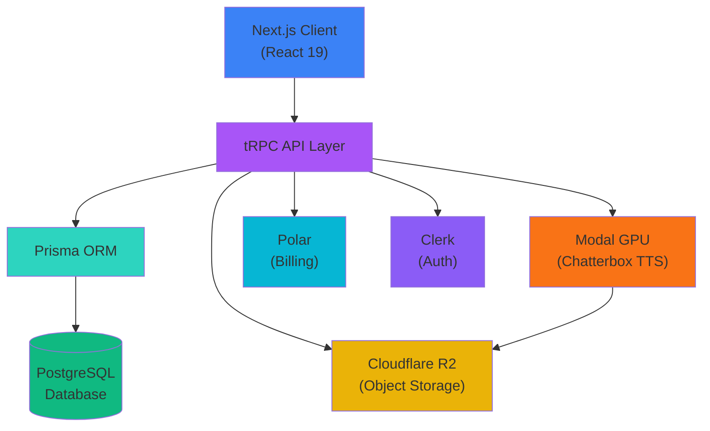

Resonance is built with a modern, scalable architecture that separates concerns between the web application, API layer, database, object storage, and GPU inference. This page explains how all the pieces fit together.

## System Overview



## Tech Stack

### Frontend

<CardGroup cols={2}>
  <Card title="Next.js 16" icon="react">
    Server-side rendering, App Router, and React Server Components for optimal performance. The app uses the `(dashboard)` route group for authenticated pages.
  </Card>
  
  <Card title="React 19" icon="atom">
    Latest React with concurrent features, automatic batching, and improved streaming SSR.
  </Card>
  
  <Card title="Tailwind CSS 4" icon="palette">
    Utility-first CSS with JIT compilation. Custom components built with shadcn/ui and Radix UI primitives.
  </Card>
  
  <Card title="WaveSurfer.js" icon="waveform">
    Audio waveform visualization with seek, play/pause, and download capabilities.
  </Card>
</CardGroup>

### Backend

<CardGroup cols={2}>
  <Card title="tRPC 11" icon="bolt">
    End-to-end typesafe APIs without code generation. Three main routers: `voices`, `generations`, and `billing`.
  </Card>
  
  <Card title="Prisma 7" icon="database">
    Type-safe database ORM with PostgreSQL adapter. Supports connection pooling and edge deployments.
  </Card>
  
  <Card title="Clerk" icon="shield">
    Authentication and multi-tenant organization management with full data isolation per org.
  </Card>
  
  <Card title="Cloudflare R2" icon="cloud">
    S3-compatible object storage for voice samples and generated audio. Generous free tier (10GB).
  </Card>
</CardGroup>

### AI Infrastructure

<CardGroup cols={2}>
  <Card title="Chatterbox TTS" icon="brain">
    Open-source zero-shot voice cloning model by Resemble AI. Supports emotional tags like `[chuckle]`, `[sigh]`, etc.
  </Card>
  
  <Card title="Modal" icon="microchip">
    Serverless GPU infrastructure (NVIDIA A10G). Pay-per-second billing with automatic scaling and cold start optimization.
  </Card>
</CardGroup>

## Database Schema

Resonance uses PostgreSQL with Prisma ORM. The schema is simple but powerful:

### Voice Model

```prisma
model Voice {
  id          String        @id @default(cuid())
  orgId       String?       // null for system voices, set for custom voices
  name        String
  description String?
  category    VoiceCategory @default(GENERAL)
  language    String        @default("en-US")
  variant     VoiceVariant  // SYSTEM or CUSTOM
  r2ObjectKey String?       // Path to audio sample in R2
  generations Generation[]
  createdAt   DateTime      @default(now())
  updatedAt   DateTime      @updatedAt
  
  @@index([variant])
  @@index([orgId])
}
```

<Accordion title="Voice Categories">
  - `AUDIOBOOK` - Narrative voices for long-form content
  - `CONVERSATIONAL` - Natural dialogue voices
  - `CUSTOMER_SERVICE` - Professional support voices
  - `GENERAL` - All-purpose voices
  - `NARRATIVE` - Storytelling voices
  - `CHARACTERS` - Character and role-play voices
  - `MEDITATION` - Calm, soothing voices
  - `MOTIVATIONAL` - Energetic, inspiring voices
  - `PODCAST` - Casual, engaging voices
  - `ADVERTISING` - Promotional voices
  - `VOICEOVER` - Professional VO work
  - `CORPORATE` - Business and training voices
</Accordion>

### Generation Model

```prisma
model Generation {
  id                String   @id @default(cuid())
  orgId             String
  voiceId           String?
  voice             Voice?   @relation(fields: [voiceId], references: [id], onDelete: SetNull)
  text              String
  voiceName         String   // Denormalized for history even if voice deleted
  r2ObjectKey       String?  // Path to generated audio in R2
  temperature       Float    // Controls creativity (0-2)
  topP              Float    // Nucleus sampling (0-1)
  topK              Int      // Top-k sampling (1-10000)
  repetitionPenalty Float    // Prevents repetition (1-2)
  createdAt         DateTime @default(now())
  updatedAt         DateTime @updatedAt
  
  @@index([orgId])
  @@index([voiceId])
}
```

<Note>
The `voiceName` field is denormalized to preserve generation history even if the source voice is deleted. The `voice` relation uses `onDelete: SetNull` to prevent cascade deletion.
</Note>

## API Layer (tRPC)

Resonance uses tRPC for type-safe API communication. All routers are composed in `src/trpc/routers/_app.ts`:

```typescript src/trpc/routers/_app.ts
import { createTRPCRouter } from '../init';
import { billingRouter } from './billing';
import { generationsRouter } from './generations';
import { voicesRouter } from './voices';

export const appRouter = createTRPCRouter({
  voices: voicesRouter,
  generations: generationsRouter,
  billing: billingRouter,
});

export type AppRouter = typeof appRouter;
```

### Key Procedures

<AccordionGroup>
  <Accordion title="generations.create - Generate TTS Audio">
    The most complex procedure. It:
    
    1. Validates the user has an active Polar subscription
    2. Fetches the voice from the database (system or custom)
    3. Calls the Chatterbox API on Modal with synthesis parameters
    4. Receives the generated audio as an ArrayBuffer
    5. Uploads the audio to R2 with org-scoped key: `generations/orgs/{orgId}/{generationId}`
    6. Saves generation metadata to the database
    7. Ingests a usage event to Polar for billing (fire-and-forget)
    8. Returns the generation ID to the client
    
    ```typescript src/trpc/routers/generations.ts (excerpt)
    const { data, error } = await chatterbox.POST("/generate", {
      body: {
        prompt: input.text,
        voice_key: voice.r2ObjectKey,
        temperature: input.temperature,
        top_p: input.topP,
        top_k: input.topK,
        repetition_penalty: input.repetitionPenalty,
        norm_loudness: true,
      },
      parseAs: "arrayBuffer",
    });
    ```
  </Accordion>
  
  <Accordion title="voices.create - Clone a Voice">
    Handles voice cloning:
    
    1. Validates the uploaded audio (minimum 10 seconds)
    2. Generates a unique voice ID with `cuid()`
    3. Uploads the audio sample to R2: `voices/custom/{orgId}/{voiceId}`
    4. Creates the voice record in the database with `variant: CUSTOM`
    5. Returns the new voice to the client
  </Accordion>
  
  <Accordion title="voices.getAll - List Available Voices">
    Returns all voices accessible to the organization:
    
    - All `SYSTEM` voices (shared across all orgs)
    - `CUSTOM` voices where `orgId` matches the current org
    
    Uses Prisma's `OR` clause for efficient querying:
    
    ```typescript
    const voices = await prisma.voice.findMany({
      where: {
        OR: [
          { variant: "SYSTEM" },
          { variant: "CUSTOM", orgId: ctx.orgId }
        ]
      }
    });
    ```
  </Accordion>
  
  <Accordion title="billing.getUsage - Fetch Usage Metrics">
    Queries Polar's usage API to get character consumption for the current billing period. Used to display usage in the dashboard.
  </Accordion>
</AccordionGroup>

## Object Storage (R2)

Cloudflare R2 stores all audio files with a consistent key structure:

```
voices/
├── system/
│   ├── {voice-id}       # Pre-seeded system voices
│   └── ...
└── custom/
    └── {org-id}/
        └── {voice-id}   # User-uploaded voice clones

generations/
└── orgs/
    └── {org-id}/
        └── {generation-id}  # Generated TTS audio
```

### R2 Client Implementation

The R2 client is a thin wrapper around AWS S3 SDK:

```typescript src/lib/r2.ts
import { S3Client, PutObjectCommand, GetObjectCommand } from "@aws-sdk/client-s3";
import { getSignedUrl } from "@aws-sdk/s3-request-presigner";

const r2 = new S3Client({
  region: "auto",
  endpoint: `https://${env.R2_ACCOUNT_ID}.r2.cloudflarestorage.com`,
  credentials: {
    accessKeyId: env.R2_ACCESS_KEY_ID,
    secretAccessKey: env.R2_SECRET_ACCESS_KEY,
  },
});

export async function uploadAudio({ buffer, key, contentType = "audio/wav" }) {
  await r2.send(new PutObjectCommand({
    Bucket: env.R2_BUCKET_NAME,
    Key: key,
    Body: buffer,
    ContentType: contentType,
  }));
}

export async function getSignedAudioUrl(key: string): Promise<string> {
  const command = new GetObjectCommand({
    Bucket: env.R2_BUCKET_NAME,
    Key: key,
  });
  return getSignedUrl(r2, command, { expiresIn: 3600 }); // 1 hour
}
```

<Info>
R2 is S3-compatible, so you can easily swap it for AWS S3, Backblaze B2, or MinIO by changing the endpoint configuration.
</Info>

## TTS Generation Flow

Here's the complete flow when a user generates speech:

<Steps>
  <Step title="User submits TTS form">
    Client calls `trpc.generations.create.mutate()` with text, voice ID, and synthesis parameters.
  </Step>
  
  <Step title="Subscription check">
    The procedure queries Polar to verify the organization has an active subscription. Throws `SUBSCRIPTION_REQUIRED` error if not.
  </Step>
  
  <Step title="Voice lookup">
    Fetches the voice from the database, ensuring it's either a system voice or a custom voice owned by the org. Validates the `r2ObjectKey` exists.
  </Step>
  
  <Step title="Call Chatterbox API">
    Makes a POST request to the Modal endpoint:
    
    ```typescript
    const { data, error } = await chatterbox.POST("/generate", {
      body: {
        prompt: input.text,
        voice_key: voice.r2ObjectKey,
        temperature: input.temperature,
        top_p: input.topP,
        top_k: input.topK,
        repetition_penalty: input.repetitionPenalty,
        norm_loudness: true,
      },
      parseAs: "arrayBuffer",
    });
    ```
    
    The Modal function:
    - Mounts the R2 bucket read-only
    - Reads the voice reference audio from R2
    - Loads the Chatterbox model (cached after first run)
    - Generates speech using the zero-shot voice cloning
    - Returns WAV audio as bytes
  </Step>
  
  <Step title="Store generation">
    1. Creates a database record with all parameters
    2. Uploads the audio buffer to R2 with key `generations/orgs/{orgId}/{generationId}`
    3. Updates the database record with the R2 key
  </Step>
  
  <Step title="Ingest usage event">
    Sends a fire-and-forget event to Polar for usage metering:
    
    ```typescript
    polar.events.ingest({
      events: [{
        name: "tts_generation",
        externalCustomerId: ctx.orgId,
        metadata: { characters: input.text.length },
        timestamp: new Date(),
      }]
    }).catch(() => {}); // Don't block on billing errors
    ```
  </Step>
  
  <Step title="Return to client">
    Returns the generation ID. The client navigates to `/text-to-speech/{generationId}` where the audio player loads via `/api/audio/{generationId}`.
  </Step>
</Steps>

<Warning>
The audio proxy route `/api/audio/{generationId}` validates org ownership before generating a signed R2 URL. This prevents unauthorized access to other organizations' audio files.
</Warning>

## Multi-Tenancy with Clerk

Resonance uses Clerk Organizations for multi-tenancy:

- Each user belongs to one or more organizations
- All tRPC procedures use the `orgProcedure` helper which injects `ctx.orgId`
- Database queries are automatically scoped to the current org
- R2 keys include org IDs for data isolation

```typescript src/trpc/init.ts (simplified)
export const orgProcedure = publicProcedure.use(async ({ ctx, next }) => {
  const { orgId } = auth(); // From Clerk
  if (!orgId) throw new TRPCError({ code: "UNAUTHORIZED" });
  return next({ ctx: { ...ctx, orgId } });
});
```

## Billing with Polar

Resonance uses Polar for usage-based billing:

1. **Products** - Define pricing tiers (e.g., $0.10 per 1000 characters)
2. **Meters** - Track usage events (`tts_generation` with character count)
3. **Subscriptions** - Link customers to products
4. **Invoices** - Generated automatically based on metered usage

The `billing` router provides a `getUsage` procedure that queries Polar's API to display current period consumption in the dashboard.

<Note>
Polar supports both sandbox and production modes. Use sandbox for development with test cards.
</Note>

## Performance Considerations

<AccordionGroup>
  <Accordion title="Cold Starts">
    Modal GPU containers have 10-15 second cold starts. After the first request, containers stay warm for ~10 minutes. Consider implementing a keep-alive ping for production.
  </Accordion>
  
  <Accordion title="Database Connection Pooling">
    Use Prisma Accelerate or PgBouncer for connection pooling in serverless environments. The `@prisma/adapter-pg` package supports this out of the box.
  </Accordion>
  
  <Accordion title="R2 Bandwidth">
    R2 has no egress fees, making it ideal for serving audio files. Use signed URLs with 1-hour expiry to prevent hotlinking.
  </Accordion>
  
  <Accordion title="Audio Streaming">
    The current implementation loads full audio files. For long-form content (>5 minutes), consider implementing range-request streaming in the audio proxy route.
  </Accordion>
</AccordionGroup>

## Project Structure

```
src/
├── app/                        # Next.js App Router
│   ├── (dashboard)/            # Protected routes
│   │   ├── page.tsx            # Home dashboard
│   │   ├── text-to-speech/     # TTS pages
│   │   └── voices/             # Voice library
│   ├── api/
│   │   ├── audio/[generationId]/  # Audio proxy (signed URLs)
│   │   ├── trpc/[trpc]/           # tRPC handler
│   │   └── voices/                # Voice creation/deletion
│   ├── sign-in/                # Clerk auth pages
│   └── sign-up/
├── components/                 # Shared UI (shadcn/ui + custom)
├── features/                   # Feature-specific components
│   ├── dashboard/
│   ├── text-to-speech/
│   ├── voices/
│   └── billing/
├── hooks/                      # React hooks
├── lib/                        # Core utilities
│   ├── db.ts                   # Prisma client
│   ├── r2.ts                   # R2 client
│   ├── chatterbox-client.ts    # Generated API client
│   ├── polar.ts                # Polar SDK
│   └── env.ts                  # Type-safe env vars
├── trpc/                       # tRPC configuration
│   ├── routers/
│   │   ├── voices.ts
│   │   ├── generations.ts
│   │   ├── billing.ts
│   │   └── _app.ts             # Root router
│   ├── init.ts                 # tRPC setup
│   └── client.tsx              # React client
├── generated/                  # Generated code (Prisma client)
└── types/                      # TypeScript types (Chatterbox API)
```

## Security

<CardGroup cols={2}>
  <Card title="Authentication" icon="lock">
    Clerk handles all auth with industry-standard security. Sessions are validated on every request.
  </Card>
  
  <Card title="Authorization" icon="user-shield">
    All database queries include org ID checks. The audio proxy validates ownership before serving files.
  </Card>
  
  <Card title="API Security" icon="key">
    The Modal endpoint requires an API key via the `x-api-key` header. Never expose this key to the client.
  </Card>
  
  <Card title="Data Isolation" icon="database-lock">
    Each org's data is stored in separate R2 paths and filtered by `orgId` in all queries.
  </Card>
</CardGroup>

## Next Steps

<CardGroup cols={2}>
  <Card title="Self-Hosting Guide" icon="server" href="/deployment/overview">
    Deploy Resonance to production
  </Card>
  
  <Card title="API Reference" icon="code" href="/api/introduction">
    Explore all tRPC endpoints
  </Card>
  
  <Card title="Configuration" icon="gear" href="/configuration/environment-variables">
    Customize environment variables and settings
  </Card>
  
  <Card title="Project Structure" icon="folder-tree" href="/guides/project-structure">
    Understand the codebase organization
  </Card>
</CardGroup>
