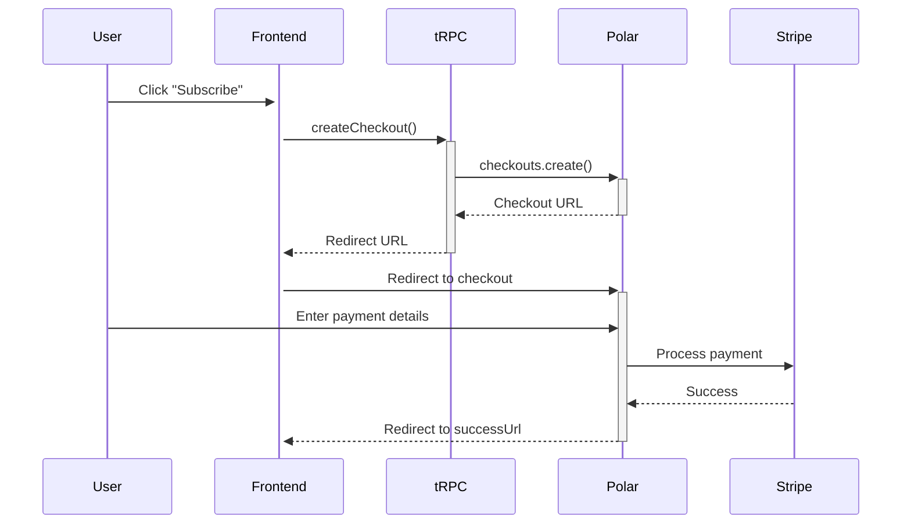
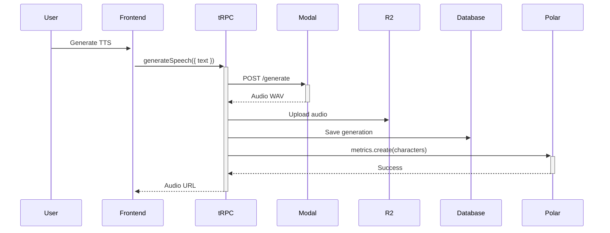
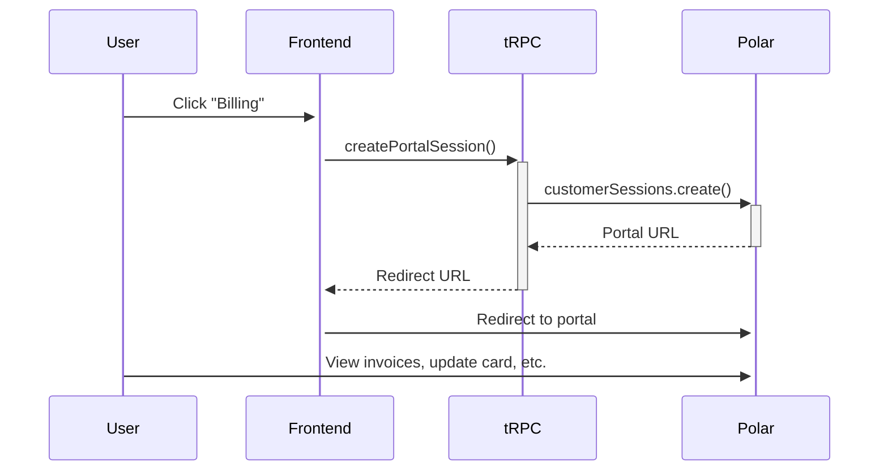

Resonance uses [Polar](https://polar.sh) for usage-based billing, charging customers based on TTS character usage. Polar provides metered billing with transparent pricing and seamless checkout.

## Why Polar?

- **Usage-Based Metering** - Bill per character generated
- **Transparent Pricing** - Clear costs for developers and customers
- **Sandbox Mode** - Test with card `4242 4242 4242 4242`
- **No Monthly Fees** - Only pay when you earn
- **Developer-Friendly API** - Simple integration via `@polar-sh/sdk`

## Prerequisites

- Polar account ([sign up free](https://polar.sh))
- Stripe account (connected via Polar for payments)

## Quick Setup

<Steps>
  <Step title="Create Polar account">
    1. Go to [Polar](https://polar.sh)
    2. Sign up with GitHub or email
    3. Connect your Stripe account when prompted
    
    <Note>
      Polar handles payments via Stripe. You'll need a Stripe account for production billing.
    </Note>
  </Step>
  
  <Step title="Create product">
    In [Polar Dashboard](https://polar.sh/dashboard), create a new product:
    
    1. Click **Products → Create Product**
    2. Configure product details:
       - **Name:** `Resonance TTS`
       - **Description:** `AI-powered text-to-speech with voice cloning`
       - **Type:** Subscription
       - **Billing Period:** Monthly
    3. Click **Create**
  </Step>
  
  <Step title="Add usage meter">
    Attach a meter to track character usage:
    
    1. Open your product
    2. Go to **Meters → Add Meter**
    3. Configure meter:
       - **Name:** `Characters Generated`
       - **Slug:** `characters`
       - **Unit:** `characters`
       - **Pricing:**
         - **Base price:** $0 (or monthly fee)
         - **Per-unit price:** $0.0001 per character (adjust based on costs)
         - Example: 10,000 characters = $1.00
    4. Click **Save**
    
    <Info>
      Adjust pricing based on your Chatterbox TTS costs on Modal. Modal charges ~$0.60/hour for A10G GPU with 5-minute scaledown.
    </Info>
  </Step>
  
  <Step title="Generate API token">
    Create an access token for the Polar API:
    
    1. Go to **Settings → API Tokens**
    2. Click **Create Token**
    3. Name: `resonance-api-token`
    4. Scopes: Select all (or minimum: `products:read`, `checkouts:write`, `customers:read`)
    5. Click **Create**
    6. Copy the token (starts with `polar_at_`)
    
    <Warning>
      The token is shown only once. Save it securely before closing.
    </Warning>
  </Step>
  
  <Step title="Configure environment variables">
    Add Polar credentials to `.env.local`:
    
    ```env .env.local
    POLAR_ACCESS_TOKEN="polar_at_..."
    POLAR_SERVER="sandbox"
    POLAR_PRODUCT_ID="prod_..."
    ```
    
    Find `POLAR_PRODUCT_ID` in the product details page URL or API response.
  </Step>
</Steps>

## Polar Client Configuration

Resonance uses the official `@polar-sh/sdk` for API calls.

### Client Setup

```typescript src/lib/polar.ts
import { Polar } from "@polar-sh/sdk";
import { env } from "./env";

export const polar = new Polar({
  accessToken: env.POLAR_ACCESS_TOKEN,
  server: env.POLAR_SERVER, // "sandbox" or "production"
});
```

Defined in `src/lib/polar.ts:4`.

**Configuration:**
- `accessToken` - API token from Polar Dashboard
- `server` - Use `sandbox` for testing, `production` for live payments

## Billing Router

The tRPC billing router handles checkout, customer portal, and usage status.

### Checkout Flow

```typescript src/trpc/routers/billing.ts
export const billingRouter = createTRPCRouter({
  createCheckout: orgProcedure.mutation(async ({ ctx }) => {
    const result = await polar.checkouts.create({
      products: [env.POLAR_PRODUCT_ID],
      externalCustomerId: ctx.orgId, // Clerk organization ID
      successUrl: env.APP_URL,
    });
    
    if (!result.url) {
      throw new TRPCError({
        code: "INTERNAL_SERVER_ERROR",
        message: "Failed to create checkout session",
      });
    }
    
    return { checkoutUrl: result.url };
  }),
});
```

Defined in `src/trpc/routers/billing.ts:7`.

**Flow:**
1. User clicks "Subscribe" in UI
2. tRPC calls `createCheckout` with organization ID
3. Polar creates checkout session
4. User is redirected to Polar checkout page
5. After payment, user returns to `successUrl`

### Customer Portal

```typescript src/trpc/routers/billing.ts
createPortalSession: orgProcedure.mutation(async ({ ctx }) => {
  const result = await polar.customerSessions.create({
    externalCustomerId: ctx.orgId,
  });
  
  if (!result.customerPortalUrl) {
    throw new TRPCError({
      code: "INTERNAL_SERVER_ERROR",
      message: "Failed to create customer portal session",
    });
  }
  
  return { portalUrl: result.customerPortalUrl };
}),
```

Defined in `src/trpc/routers/billing.ts:24`.

**Features:**
- View invoices and payment history
- Update payment method
- Cancel subscription
- Download receipts

### Usage Status

```typescript src/trpc/routers/billing.ts
getStatus: orgProcedure.query(async ({ ctx }) => {
  try {
    const customerState = await polar.customers.getStateExternal({
      externalId: ctx.orgId,
    });
    
    const hasActiveSubscription =
      (customerState.activeSubscriptions ?? []).length > 0;
    
    // Sum up estimated costs from all meters across active subscriptions
    let estimatedCostCents = 0;
    for (const sub of customerState.activeSubscriptions ?? []) {
      for (const meter of sub.meters ?? []) {
        estimatedCostCents += meter.amount ?? 0;
      }
    }
    
    return {
      hasActiveSubscription,
      customerId: customerState.id,
      estimatedCostCents,
    };
  } catch {
    // Customer doesn't exist yet in Polar
    return {
      hasActiveSubscription: false,
      customerId: null,
      estimatedCostCents: 0,
    };
  }
}),
```

Defined in `src/trpc/routers/billing.ts:39`.

**Returns:**
- `hasActiveSubscription` - Whether user has an active subscription
- `customerId` - Polar customer ID (null if not yet created)
- `estimatedCostCents` - Current billing cycle usage in cents

## Usage Metering

Resonance reports character usage to Polar after each generation.

### Reporting Usage

Whenever TTS is generated, the character count is reported:

```typescript
import { polar } from "@/lib/polar";

// After successful generation
const generation = await prisma.generation.create({
  data: {
    orgId: ctx.orgId,
    text: input.text,
    voiceId: input.voiceId,
    // ... other fields
  },
});

// Report usage to Polar
try {
  await polar.metrics.create({
    metric: "characters",
    value: input.text.length,
    externalCustomerId: ctx.orgId,
  });
} catch (error) {
  // Log error but don't fail generation
  console.error("Failed to report usage to Polar:", error);
}
```

Used in generation routers under `src/trpc/routers/`.

<Note>
  Usage is aggregated by Polar and billed at the end of each billing period.
</Note>

### Character Counting

Resonance counts **all characters** in the input text, including:
- Letters and numbers
- Spaces and punctuation
- Special markup (e.g., `[chuckle]`, `[pause]`)

Example: `"Hello world [chuckle]"` = 21 characters

## Customer Lifecycle

### 1. Initial Checkout



### 2. Generation with Metering



### 3. Customer Portal Access



## Sandbox vs Production

### Sandbox Mode

Use for development and testing:

```env .env.local
POLAR_SERVER="sandbox"
```

**Features:**
- Test card: `4242 4242 4242 4242` (any future expiry, any CVC)
- No real charges
- Separate customer database from production
- Full API functionality

<Info>
  Sandbox mode uses Stripe test mode behind the scenes.
</Info>

### Production Mode

Use for live payments:

```env .env.production
POLAR_SERVER="production"
```

**Requirements:**
- Connected Stripe account with real bank details
- Tax settings configured
- Terms of service and privacy policy links

## Pricing Examples

### Example Pricing Model

```
Base: $0/month (free tier or base subscription)
Usage: $0.0001 per character

Examples:
- 1,000 characters = $0.10
- 10,000 characters = $1.00
- 100,000 characters = $10.00
- 1,000,000 characters = $100.00
```

### Free Tier Option

To offer a free tier, create two products:

1. **Free Tier** - No payment required, limit usage in app code
2. **Pro Tier** - Paid subscription with metering

Gate features based on `hasActiveSubscription` from `getStatus()`:

```typescript
const { hasActiveSubscription } = await trpc.billing.getStatus.query();

if (!hasActiveSubscription && generationCount >= FREE_TIER_LIMIT) {
  throw new Error("Free tier limit reached. Please subscribe.");
}
```

## Webhooks (Optional)

For real-time billing events, configure webhooks:

<Steps>
  <Step title="Create webhook endpoint">
    ```typescript src/app/api/webhooks/polar/route.ts
    import { polar } from "@/lib/polar";
    
    export async function POST(request: Request) {
      const payload = await request.json();
      const signature = request.headers.get("polar-signature");
      
      // Verify webhook signature
      // Handle events: subscription.created, subscription.updated, etc.
      
      return Response.json({ received: true });
    }
    ```
  </Step>
  
  <Step title="Register in Polar Dashboard">
    1. Go to **Settings → Webhooks**
    2. Add endpoint: `https://yourdomain.com/api/webhooks/polar`
    3. Select events to receive
  </Step>
</Steps>

<Note>
  Webhooks are optional. The `getStatus()` query provides current subscription state on-demand.
</Note>

## Testing Billing

### Sandbox Checkout Flow

<Steps>
  <Step title="Set sandbox mode">
    ```env .env.local
    POLAR_SERVER="sandbox"
    ```
  </Step>
  
  <Step title="Create checkout">
    In your app, click "Subscribe" to generate a checkout URL
  </Step>
  
  <Step title="Complete checkout">
    Use test card:
    - **Card number:** `4242 4242 4242 4242`
    - **Expiry:** Any future date
    - **CVC:** Any 3 digits
    - **ZIP:** Any 5 digits
  </Step>
  
  <Step title="Verify subscription">
    Check that `hasActiveSubscription` is now `true`
  </Step>
  
  <Step title="Generate TTS">
    Create generations and verify usage is tracked in Polar Dashboard
  </Step>
</Steps>

### Simulating Usage

Generate test generations with varying text lengths:

```typescript
const testTexts = [
  "Short text", // 10 chars
  "Medium length text for testing billing", // 41 chars
  "Very long text...".repeat(100), // ~1800 chars
];

for (const text of testTexts) {
  await trpc.generations.create.mutate({ text, voiceId });
}
```

Check meter values in **Polar Dashboard → Customers → [Your Test Org]**.

## Troubleshooting

### Checkout creation fails

```
Failed to create checkout session
```

**Checklist:**
1. Verify `POLAR_ACCESS_TOKEN` is correct
2. Check `POLAR_PRODUCT_ID` exists and is active
3. Ensure product has a meter configured
4. Confirm Stripe account is connected (for production)

### Usage not tracked

**Checklist:**
1. Verify `polar.metrics.create()` is called after generation
2. Check meter slug matches: `characters`
3. Ensure `externalCustomerId` is the Clerk org ID
4. Look for errors in server logs

### Customer not found

```
Customer doesn't exist yet in Polar
```

**This is normal:**
- Customers are created automatically on first checkout
- `getStatus()` returns `hasActiveSubscription: false` if customer doesn't exist
- Prompt user to subscribe

### Sandbox card declined

Use the exact test card: `4242 4242 4242 4242`

Other test cards for specific scenarios:
- **Decline:** `4000 0000 0000 0002`
- **Insufficient funds:** `4000 0000 0000 9995`

See [Stripe test cards](https://stripe.com/docs/testing) for more.

## Cost Estimation

### Modal GPU Costs

Chatterbox TTS runs on Modal with NVIDIA A10G GPU:

- **GPU:** ~$0.60/hour
- **Scaledown:** 5 minutes idle before shutdown
- **Cold start:** ~30 seconds

**Example calculation:**
- 100 generations/hour ≈ 36 seconds per generation
- GPU active time: ~1 hour
- Cost: $0.60/hour
- Per generation: $0.006

### Pricing Strategy

To cover costs with margin:

```
Modal cost: $0.006 per generation
Average generation: 100 characters
Cost per character: $0.006 / 100 = $0.00006

Your pricing: $0.0001 per character (67% margin)
```

Adjust based on:
- Actual Modal costs (varies by usage pattern)
- Desired profit margin
- Competitive pricing

## Related Documentation

<CardGroup cols={2}>
  <Card title="Clerk Auth" icon="shield" href="/configuration/clerk-auth">
    Organization IDs for customer scoping
  </Card>
  <Card title="Environment Variables" icon="key" href="/configuration/environment-variables">
    Required Polar environment variables
  </Card>
  <Card title="Modal Deployment" icon="server" href="/configuration/modal-deployment">
    GPU costs and optimization
  </Card>
  <Card title="Polar Documentation" icon="book" href="https://docs.polar.sh">
    Official Polar documentation
  </Card>
</CardGroup>